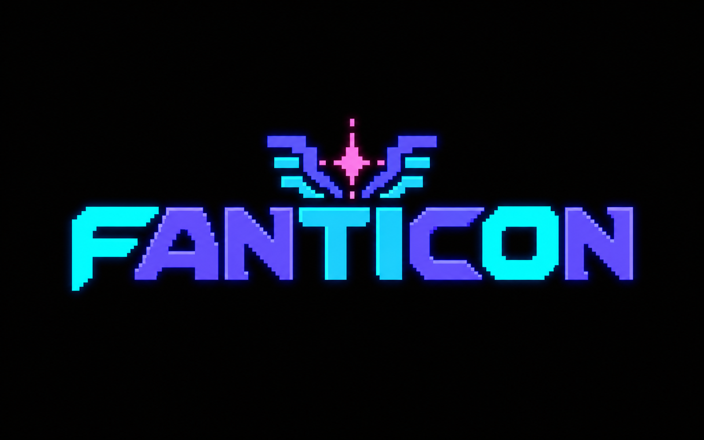

# Fanticon

<p align="center">
  
</p>

<p align="center">
  A free, open-source 6502 fantasy console with built-in tools for creating,
  playing, and exporting real retro games.
</p>

<p align="center">
  <a href="https://github.com/essial/fanticon/releases/latest"><strong>Download Fanticon</strong></a>
  ·
  <a href="#get-started"><strong>Get started</strong></a>
  ·
  <a href="#documentation"><strong>Documentation</strong></a>
</p>

<p align="center">
  <a href="https://github.com/essial/fanticon/actions/workflows/ci.yml"></a>
  <a href="https://github.com/essial/fanticon/releases/latest"></a>
  <a href="LICENSE-MIT"></a>
</p>

Fanticon recreates the experience of developing for a late-1980s game console
without requiring vintage hardware or a separate toolchain. Write 6502
assembly, draw graphics, compose music, debug your game, and export it for
desktop or the web—all from one application.

It is designed for retro game developers, 6502 programmers, emulator
enthusiasts, and anyone who wants a constrained game-development environment
grounded in authentic hardware behavior.

## Highlights

- **Everything built in** — code, graphics, music, assembler, and debugging tools.
- **Authentic 6502 programming** — a cycle-accurate NMOS 6502 with all 256
  opcodes, including undocumented instructions and hardware quirks.
- **Purpose-built game hardware** — 320×200 tile, sprite, and bitmap graphics
  with four-voice audio and dot-timestamped raster effects.
- **Shareable cartridges** — package games as versioned `.FCN` files with 4 MiB
  ROM banking and battery-backed save RAM.
- **Cross-platform exports** — produce web, Windows, Linux, and macOS releases
  without installing target SDKs.

## Download

Prebuilt binaries for the current version are published on the
[latest release page](https://github.com/essial/fanticon/releases/latest):

| Platform | Architecture   | Installer               | Portable                       |
| -------- | -------------- | ------------------------ | ------------------------------- |
| Windows  | x86_64 / arm64 | `Fanticon-Setup-*.exe`   | `fanticon-*-windows-*.zip`      |
| Linux    | x86_64 / arm64 | `fanticon_*.deb`         | `fanticon-*-linux-*.tar.gz`     |
| macOS    | universal      | `fanticon-*-macos.dmg`   | `fanticon-*-macos-universal.zip`|

Portable archives need no installation: unzip or untar the archive and run
`fanticon-app` (or `fanticon-app.exe` on Windows) directly. See
[Building from source](#building-from-source) to build it yourself instead.

## Get started

Launching Fanticon drops you into the native editor's command console.

1. `NEW PROJECT` creates a cartridge project with a manifest and starter source.
2. Write 6502 assembly in the built-in editor — syntax highlighting, symbol
   navigation, and inline diagnostics included.
3. `BUILD` assembles it; `RUN` launches it straight into Game mode.
4. Press Escape to return to the editor. Battery-backed save RAM is flushed
   first, so `RUN` is safe to use as a normal play-test loop.

When the game is ready to share, the bundled `fanticon-export` tool produces an
offline web app and native packages without requiring Rust, WebAssembly tools,
platform SDKs, or the target operating system. See the
[export guide](documentation/exporting.md) for the complete workflow.

An existing cartridge can be opened with `RUN GAME.FCN` from the console, or
launched directly:

```sh
fanticon-app /path/to/GAME.FCN
```

Cartridges launched this way ignore Escape, since there's no editor session to
return to. To land straight in Game mode instead of the editor on startup, add
`--game`.

## What you get

- **Cycle-accurate NMOS 6502** — all 256 opcodes, including undocumented
  instructions, dummy reads/writes, and hardware quirks like RESET's
  seven-cycle sequence, IRQ/NMI polling behavior, RDY stalls, and SO edges.
  If it runs on real hardware, it should run here.
- **320×200 indexed video** with tile, sprite, and bitmap modes, dot-timestamped
  raster events for mid-frame effects, and a CRT presentation pass.
- **Four-voice audio** — two pulse channels, triangle, and noise, NES-shaped
  and exactly timed against the CPU clock.
- **Native development tools** — a full-screen code editor, a macro assembler
  with named/defaulted parameters, private labels, compile-time conditionals and
  repetition, project manifests, and an integrated debugger with breakpoints and
  raster triggers.
- **Versioned `.FCN` cartridges** — 4 MiB ROM banking, battery-backed save
  RAM, and CRC-checked headers.
- **Cross-platform** — native Windows, Linux, and macOS builds (x86_64 and
  arm64), plus WebAssembly from the same source.
- **Flexible presentation** — clean pixel, VGA, arcade CRT, consumer CRT, LCD,
  and amber-monitor styles shared by the editor and game runtime.
- **Runtime diagnostics** — an optional overlay reports frame pacing, audio
  buffering, underruns, and the active renderer without exposing anything to
  cartridge code.

Game mode is hardware-accurate at 320×200; the native editor runs at 640×400
with an 80×50 character grid. In a running game, press F10 or the gamepad Guide
button for the system menu.

## Documentation

Start with the [6502 Programmer's Reference](documentation/6502.md) when writing
programs for the Fanticon VM.

| Topic | Guide |
| --- | --- |
| CPU instructions, addressing, cycles, and optimization | [6502 Programmer's Reference](documentation/6502.md) |
| Display modes, sprites, raster effects, and scaling | [Video architecture](documentation/video.md) |
| Voices, waveforms, timing, and mixing | [Audio programmer's reference](documentation/audio.md) |
| Graphics styles, audio processing, and the system menu | [Presentation settings](documentation/settings.md) |
| Commands, shortcuts, help, and the code editor | [Editor and command console](documentation/editor.md) |
| Tracker editing, NSF import, playlists, and playback | [Music editor and playback](documentation/music-editor.md) |
| Tile, map, sprite, bitmap, palette, and PNG tools | [Graphics editor](documentation/graphics-editor.md) |
| Syntax, directives, macros, and diagnostics | [Macro assembler](documentation/assembler.md) |
| Clock, memory, I/O, controllers, interrupts, and timers | [System architecture](documentation/system-architecture.md) |
| CPU, I/O, and VRAM lookup tables | [Memory-map quick reference](documentation/memory-map.md) |
| `.FCN` headers, ROM banking, save RAM, and persistence | [Cartridge format](documentation/cartridge-format.md) |
| Manifests, bank-aware builds, packaging, and debugging | [Cartridge projects](documentation/cartridge-projects.md) |
| Web and native release packaging | [Exporting games](documentation/exporting.md) |
| Frozen contracts and remaining implementation work | [System-details checklist](documentation/system-details-checklist.md) |

## Project status

Fanticon is under active pre-1.0 development. The v0.1 hardware and cartridge
contracts identified in the
[system-details checklist](documentation/system-details-checklist.md) are frozen,
while the editor, host, and creation workflow continue to evolve. Bug reports,
compatibility testing, documentation improvements, and games made with Fanticon
are welcome through [GitHub Issues](https://github.com/essial/fanticon/issues).

## Building from source

Clone Fanticon with its test fixtures:

```sh
git clone --recurse-submodules https://github.com/essial/fanticon.git
```

For an existing checkout, initialize the submodule once:

```sh
git submodule update --init --depth 1
```

```sh
cargo run --release
```

Native app builds mirror each folder inside the repository's `code-assets`
directory directly into `Documents/Fanticon`. This makes the checked-in examples
available at `/demos` and the standard hardware definitions available at
`/FANTICON.INC`, while keeping the repository copy authoritative and preserving
unrelated user files. The assembler also embeds that include, so every project
can use `INCLUDE FANTICON.INC` on native and web builds. The editor opens the
root system include from that embedded source as a read-only document; the
managed disk copy is only there to make it browsable. Set
`FANTICON_SKIP_CODE_ASSET_SYNC=1` to skip this developer convenience when needed.

```sh
cargo run --release -- /path/to/GAME.FCN   # launch a cartridge directly
cargo run --release -- --game              # start in Game mode
```

In VS Code, install the recommended CodeLLDB and rust-analyzer extensions, then
press F5 and select **Fanticon App (Debug)**. VS Code builds the correct binary
automatically before opening the app under the debugger.

### Cross-compiling

Use ordinary Rust target triples, for example:

```sh
cargo build --release --target x86_64-pc-windows-msvc
cargo build --release --target aarch64-pc-windows-msvc
cargo build --release --target x86_64-unknown-linux-gnu
cargo build --release --target aarch64-unknown-linux-gnu
cargo build --release --target aarch64-apple-darwin
rustup target add wasm32-unknown-unknown
cargo build --release --target wasm32-unknown-unknown
```

The `cdylib` output is the WebAssembly-facing library while `rlib` is the
zero-overhead native integration path — build with `--no-default-features` to
omit all windowing and GPU dependencies if you only need the CPU/VM core.

CI builds and tests the library on x86_64 Windows, Linux, and macOS, and on
native arm64 Linux; it cross-compiles and build-checks arm64 Windows, and
separately compiles the same core for `wasm32-unknown-unknown`. macOS builds
run on Apple Silicon runners and cover both `aarch64-apple-darwin` and
`x86_64-apple-darwin`.

### Testing

Ordinary tests automatically use `tests/SingleStepTests/6502/v1`. The 256 opcode
files are exposed as 256 independently reported tests and run in parallel by
default. Release mode is recommended for the complete 2.56-million-case suite:

```sh
cargo test --release -- --nocapture
cargo build --release
```

Run the headless whole-machine performance workloads with:

```sh
cargo bench --no-default-features --bench vm
```

The report covers the audio, bitmap, raster, sprite, tile, and two-axis wave
demo cartridges and prints frames per second, emulated cycles per second, the
multiple of Fanticon's required 60 Hz real-time rate, and steady-state allocation
calls per frame.

Browser runtime tests use `wasm-pack` and headless Chrome:

```sh
wasm-pack test --headless --chrome --test web_runtime
```

They execute a cartridge inside WebAssembly and verify controller sampling,
indexed video output, generated audio, and persistent `.SAV` serialization
through browser storage.

Run one opcode by filtering on its test name:

```sh
cargo test --release --test singlestep opcode_a9 -- --nocapture
```

Limit every selected opcode to its first 100 cases while developing:

```sh
SINGLESTEP_LIMIT=100 cargo test --test singlestep opcode_a9 -- --nocapture
```

Rust chooses the parallelism from the machine's available CPU count. Override it
when needed, for example with `--test-threads=4` or `--test-threads=1` after the
second `--`. `SINGLESTEP_6502_DIR` remains available as an optional fixture-path
override. The fixtures are pinned beneath `tests/` as a Git submodule instead of
being copied into Fanticon's Git history.

## License

Fanticon is dual-licensed under the [MIT License](LICENSE-MIT) or the
[Apache License, Version 2.0](LICENSE-APACHE), at your option.
