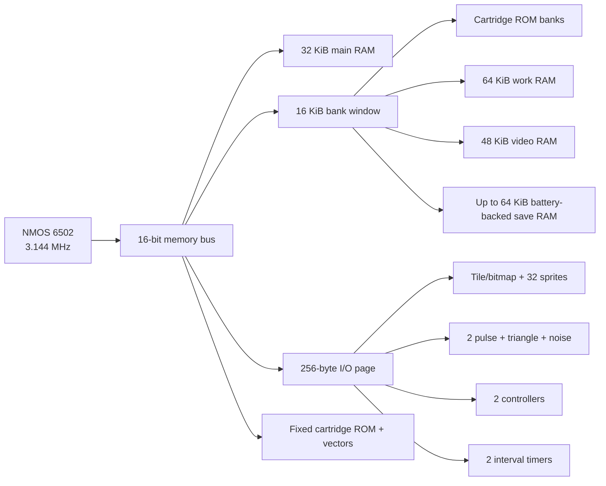

# Fanticon System Architecture

This document defines the v0.1 Fanticon virtual machine seen by game code. It is
the contract for the mapped bus and future video, audio, input, timer, and
cartridge implementations. Native editor tools run outside this machine.

For a compact address-first reference without the design discussion, use the
[Fanticon Memory Map](memory-map.md). Cartridge and persistent-storage files are
specified separately in the [Fanticon Cartridge Format](cartridge-format.md).

The design aims for the mental model of a capable late-1980s console: a 6502,
memory-mapped chips, banked memory, tiles, sprites, a small PSG-style APU, and
raster interrupts. It deliberately avoids caches, pipelines, filesystems inside
the VM, multiple scrolling layers, general DMA, and a large hierarchy of device
modes.

Fanticon takes inspiration rather than reproducing one existing machine. MOS's
6500 manuals establish the CPU and memory-mapped-I/O model; the 6522 VIA provides
the precedent for simple timers and shared interrupt flags. The display borrows
the programmable-raster philosophy of controllers such as the MC6845 while
providing game-oriented tile and sprite fetchers. The APU has the recognizable
two-pulse, triangle, and noise shape of the NES, with a simpler register model.

## Design principles

1. **Small enough to memorize.** The entire map fits on one page and every
   standard device occupies the `$C000` I/O page.
2. **Hardware-shaped games.** Tiles, sprites, palette banks, scanline timing,
   interrupts, and bank switching matter to software.
3. **No accidental bottlenecks.** The CPU never has to redraw 64,000 pixels just
   to move a character; tile and sprite hardware handles ordinary games.
4. **Cycle-deterministic.** A cartridge behaves identically on every host and
   can intentionally race the raster beam.
5. **Friendly constraints.** Direct registers replace historical interface
   rituals that added cost without adding useful creative decisions.
6. **Room to grow without moving addresses.** Reserved addresses read `$FF` and
   are ignored on write until a later architecture version assigns them.

## System at a glance



## Master timing

| Quantity | Value |
| --- | ---: |
| Frame rate | 60 Hz |
| Scanlines per frame | 262 |
| Visible scanlines | 200 |
| Video dots per scanline | 400 |
| Visible dots per line | 320 |
| Video dot clock | 6.288 MHz |
| Video dots per CPU cycle | 2 |
| CPU cycles per scanline | 200 |
| CPU cycles per frame | 52,400 |
| CPU clock | 3.144 MHz |

Lines `0-199` and dots `0-319` are visible. Horizontal blank occupies dots
`320-399`; vertical blank occupies lines `200-261`. VBlank begins at line 200,
dot 0. There is no PAL variant in v0.1.

Each CPU bus cycle spans two video dots. Its transfer becomes visible to a device
on the second dot of that cycle, before the video fetch for that dot. This gives
register and VRAM writes exact, reproducible raster timing. The video side of
VRAM is dual-ported: v0.1 has no CPU wait states or display-induced bus stealing.
The hardware character comes from observable timing rather than unpredictable
contention.

Within every CPU cycle, the raster fetches the first dot, the CPU bus transfer
completes on the second dot, mapped writes become visible, timers and audio
advance, and then the raster fetches that second dot. New interrupt conditions
set pending bits last. A same-cycle IRQ clear therefore cannot erase an event
that has just occurred.

## CPU memory map

| Address | Size | Purpose |
| --- | ---: | --- |
| `$0000-$7FFF` | 32 KiB | Main RAM |
| `$8000-$BFFF` | 16 KiB | Banked cartridge, work RAM, VRAM, or save-RAM window |
| `$C000-$C0FF` | 256 B | Memory-mapped I/O |
| `$C100-$FFFF` | 16,128 B | Fixed cartridge ROM and CPU vectors |

Zero page and the stack retain their normal 6502 locations inside main RAM.
Fixed ROM contains NMI at `$FFFA`, RESET at `$FFFC`, and IRQ/BRK at `$FFFE`.
Writes to cartridge ROM are ignored. Unmapped and reserved reads return `$FF`;
writes are ignored. v0.1 does not emulate a floating last-value data bus.

### Bank window

`BANK_KIND` and `BANK_NUMBER` select what appears at `$8000-$BFFF`. The mapping
changes after the `BANK_NUMBER` or `BANK_KIND` write cycle completes. Code should
switch banks while executing from main RAM or fixed ROM.

| Kind | `BANK_KIND` | Valid banks | Backing storage |
| --- | ---: | ---: | --- |
| Cartridge | `$00` | 0-255 | Up to 4 MiB read-only cartridge ROM |
| Work RAM | `$01` | 0-3 | 64 KiB volatile banked RAM |
| Video RAM | `$02` | 0-2 | 48 KiB VRAM |
| Save RAM | `$03` | 0-3 | Up to 64 KiB persistent cartridge RAM |

Invalid kinds or bank numbers expose an unmapped window. Reset selects cartridge
bank 0. Work RAM is convenient for level data, decompression, music state, and
save-like scratch storage; only the lower 32 KiB main RAM is always visible.
Save RAM is optional and is persisted by the host; a cartridge with fewer than
four save banks exposes its remaining bank numbers as unmapped.

## I/O map

| Address | Device |
| --- | --- |
| `$C000-$C00F` | Banking, interrupt controller, frame counter |
| `$C010-$C02F` | Video control and palette |
| `$C030-$C040` | Audio channels and master control |
| `$C050-$C05F` | Controllers |
| `$C060-$C06F` | Two interval timers |
| `$C070-$C0FF` | Reserved |

All multi-byte values are little-endian. Unless a register says otherwise,
reserved bits read as zero and must be written as zero.

### System registers

| Address | Name | Access | Purpose |
| --- | --- | --- | --- |
| `$C000` | `BANK_KIND` | R/W | Select cartridge, work RAM, VRAM, or save RAM |
| `$C001` | `BANK_NUMBER` | R/W | Select a bank within that kind |
| `$C002` | `IRQ_PENDING` | R/W1C | Pending interrupt-source bits |
| `$C003` | `IRQ_ENABLE` | R/W | Sources allowed to assert CPU IRQ |
| `$C004` | `FRAME_LOW` | R | Frame counter bits 0-7 |
| `$C005` | `FRAME_HIGH` | R | Frame counter bits 8-15 |
| `$C006` | `MACHINE_MAJOR` | R | Hardware major version, currently 1 |
| `$C007` | `MACHINE_MINOR` | R | Hardware minor version, currently 0 |

Reading `FRAME_LOW` latches the corresponding high byte until `FRAME_HIGH` is
read, giving software a coherent low-then-high snapshot. The frame counter
increments at line 0, dot 0 and wraps naturally.

`IRQ_PENDING` and `IRQ_ENABLE` use these bits:

| Bit | Source |
| ---: | --- |
| 0 | VBlank start |
| 1 | Raster compare |
| 2 | Timer 0 |
| 3 | Timer 1 |
| 4-7 | Reserved |

The sources are ORed onto the 6502's level-sensitive IRQ pin. Multiple bits may
be pending together; hardware assigns no priority and acknowledges nothing on
interrupt entry. Writing a one to a pending bit acknowledges it; writing zero
leaves it unchanged. Disabling a source does not erase its pending state. NMI is
reserved for a future cartridge or debugging facility and is not driven by
standard v0.1 devices.

## Video hardware

The output is always 320×200 indexed color. Games select one background mode and
may overlay the same 32 hardware sprites in either mode:

| `VIDEO_MODE` | Mode |
| ---: | --- |
| 0 | Blank/backdrop color |
| 1 | 320×200 viewport into a 64×32 map of 8×8, 4-bpp tiles |
| 2 | Packed 320×200, 4-bpp bitmap |

This is intentionally one background layer, not a general scene graph. Tile mode
is the efficient default for action games; bitmap mode supports illustrations,
adventures, paint-style games, and software-rendered effects.

### Palette

There are 256 palette entries arranged naturally as 16 banks of 16 colors. Each
entry stores one RGB332 byte. Write an entry number to `PALETTE_INDEX`, then write
RGB332 values to `PALETTE_DATA`; the index increments after every data write and
wraps at 255. Reads return the indexed value and increment identically. Palette
writes take effect at their exact raster timestamp, making scanline and mid-line
palette splits possible.

At reset, entry `N` contains RGB332 byte `N`. Conversion to the raw display uses
`round(R3*255/7)`, `round(G3*255/7)`, and `round(B2*255/3)` before host CRT
presentation effects.

Tile and sprite pixels contain a 4-bit color and select one of the 16 palette
banks. Bitmap mode uses `BITMAP_PALETTE` as the palette-bank number for the whole
bitmap. Sprite color zero is transparent; background color zero is opaque.

### VRAM layout

In tile mode, VRAM contains:

| VRAM offset | Size | Purpose |
| --- | ---: | --- |
| `$0000-$1FFF` | 8 KiB | 256 packed 4-bpp tile patterns |
| `$2000-$27FF` | 2,048 B | 64×32 tile numbers |
| `$2800-$2FFF` | 2,048 B | 64×32 tile attributes |
| `$3000-$30FF` | 256 B | 32 eight-byte sprite records |
| `$3100-$3FFF` | — | Reserved/scratch VRAM |

Each tile occupies 32 bytes. Every byte contains two horizontal pixels: the high
nibble is the left pixel, then the low nibble. Tile-map offset is `y*64+x`.

Tile attributes are:

```text
bit 7    reserved
bit 6    foreground priority
bit 5    vertical flip
bit 4    horizontal flip
bits 3-0 palette bank
```

Scroll X and Y independently wrap across the 512×256-pixel circular tile map,
allowing movement in all four directions. The visible viewport remains 320×200.
Increasing X moves the viewport right and the visible tiles left; decreasing X
moves it left. Increasing Y moves the viewport down and the visible tiles up;
decreasing Y moves it up. The off-screen margin lets games replace rows and
columns after they leave the viewport, supporting indefinitely streamed worlds.

For an infinite world, treat the 64×32 map as a ring buffer. Keep world-space
camera coordinates in game RAM, write `SCROLL_X/Y` from their low 16 bits, and
map a world tile `(wx,wy)` to hardware cell `(wx & 63, wy & 31)`. When the camera
crosses an eight-pixel tile boundary, populate the newly approaching off-screen
row or column during VBlank. The 320×200 viewport consumes at most 41×26 cells
when partially scrolled, leaving at least 23 hidden columns and six hidden rows.

In bitmap mode, offsets `$4000-$BCFF` in VRAM banks 1-2 are 32,000 packed pixels
in row-major order. The high nibble is the even X pixel and the low nibble is the
odd X pixel. The remaining `$BD00-$BFFF` bytes are reserved. Bank 0 continues to
hold sprite patterns and records, so sprites work normally over bitmap graphics.
Scroll registers have no effect in bitmap mode.

### Sprites

Fanticon provides 32 sprites, evaluated in record order. Each record is:

| Byte | Meaning |
| ---: | --- |
| 0 | X low byte |
| 1 | Bit 0: X bit 8; bit 1: behind-background priority |
| 2 | Y position |
| 3 | First tile number |
| 4 | Palette 0-15, H flip, V flip, 16×16 size, enable |
| 5-7 | Reserved |

Attribute byte 4 uses palette in bits 0-3, H flip in bit 4, V flip in bit 5,
16×16 size in bit 6, and enable in bit 7. An 8×8 sprite uses one tile. A 16×16
sprite uses four consecutive tiles arranged `N,N+1` above `N+2,N+3` and requires
a tile number divisible by four. Flips apply to the complete sprite.

X values `$1F0-$1FF` represent -16 through -1; Y values `$F0-$FF` represent -16
through -1. This lets objects enter from the left or top without larger records.
Sprites clip at all screen edges and never wrap.

At most eight sprites are drawn on one scanline. Lower record numbers win overlap
ties. Every enabled sprite whose vertical extent intersects the line counts,
even when horizontally off-screen or transparent on that line. A ninth candidate
sets the sprite-overflow status bit and is not drawn.

Sprite color zero is transparent. A nonzero tile pixel with foreground priority
covers every sprite. Otherwise, a sprite's behind-background flag puts it below
a nonzero background pixel; a front sprite wins. Background color zero never
hides a sprite, though its palette color is still displayed when no sprite is
present. Bitmap mode has no tile foreground flag and uses only the sprite flag.
There is no hardware collision register in v0.1; games perform gameplay collision
against their own objects rather than rendered pixels.

### Video registers

| Address | Name | Purpose |
| --- | --- | --- |
| `$C010` | `VIDEO_MODE` | Blank, tile, or bitmap background |
| `$C011` | `VIDEO_CONTROL` | Bit 0: background enable; bit 1: sprite enable |
| `$C012` | `BACKDROP_COLOR` | Full 8-bit palette index behind disabled backgrounds |
| `$C013-$C014` | `SCROLL_X` | Signed 16-bit tile-map horizontal scroll |
| `$C015-$C016` | `SCROLL_Y` | Signed 16-bit tile-map vertical scroll |
| `$C017-$C018` | `RASTER_X` | Compare dot, 0-399 |
| `$C019-$C01A` | `RASTER_Y` | Compare line, 0-261 |
| `$C01B` | `PALETTE_INDEX` | Palette address |
| `$C01C` | `PALETTE_DATA` | RGB332 data with auto-increment |
| `$C01D` | `BITMAP_PALETTE` | Bitmap palette bank, low nibble |
| `$C01E` | `VIDEO_STATUS` | VBlank, HBlank, sprite overflow |

The raster source becomes pending once per visit when both compare coordinates
match. Clearing it at that coordinate does not retrigger it. Programming a point
ahead of the beam may trigger in the current frame; a passed point waits for the
next frame. Reset target `(511,511)` is unreachable.

Scroll values use 16-bit two's-complement representation before wrapping to the
512x256 tilemap. Consequently `$FFFF` means -1 on either axis, which makes a
one-pixel decrement at zero continue smoothly across the corresponding edge.

`VIDEO_STATUS` bit 0 is live VBlank, bit 1 is live HBlank, and bit 2 is sprite
overflow latched for the frame. Other bits read zero and reads clear nothing.
HBlank covers dots 320-399, VBlank covers lines 200-261, and overflow clears at
line 0, dot 0.

The background and sprite layers can be enabled independently. Clearing
`VIDEO_CONTROL` bit 0 turns off the tilemap or bitmap without changing its mode,
VRAM, scroll position, or palette; the display shows `BACKDROP_COLOR` instead.
Sprites may remain visible over that color when bit 1 is still set. Mode 0 also
forces the background to the backdrop color. Because `BACKDROP_COLOR` is a full
palette index, games may select any of the 256 programmable colors.

Video fetches pattern, map, attribute, palette, and bitmap data as the beam needs
them. Palette, backdrop, scroll, enable, mode, and VRAM writes affect the next
pixel fetched. Sprite records are the exception: they are sampled at the start
of each scanline, providing a simple deterministic rule for multiplexing.

## Audio hardware

The exact programmer-visible contract is in the
[Fanticon Audio Programmer's Reference](audio.md).

The APU is deliberately close to the NES channel lineup:

- Pulse 1: four duty cycles and 4-bit volume
- Pulse 2: four duty cycles and 4-bit volume
- Triangle: a fixed 32-step waveform
- Noise: 15-bit LFSR with long and short tap modes and 4-bit volume

It is not a cycle-for-cycle clone of the NES APU. v0.1 omits hardware sweeps,
envelopes, length counters, and the NES frame sequencer. Those features are easy
to reproduce in software at VBlank or with a Fanticon timer, while their original
edge cases would greatly expand the programming model.

Each channel occupies four registers:

| Address | Channel |
| --- | --- |
| `$C030-$C033` | Pulse 1 |
| `$C034-$C037` | Pulse 2 |
| `$C038-$C03B` | Triangle |
| `$C03C-$C03F` | Noise |
| `$C040` | Master enable and 4-bit master volume |

For each pulse channel, offset 0 contains enable, duty, and volume; offsets 1-2
contain an 11-bit timer; writing offset 3 resets phase. Duty choices are 12.5%,
25%, 50%, and 75%. Pulse frequency is:

```text
CPU_CLOCK / (16 × (timer + 1))
```

Triangle offset 0 enables the channel, offsets 1-2 hold its 11-bit timer, and a
write to offset 3 resets phase. Its frequency is:

```text
CPU_CLOCK / (32 × (timer + 1))
```

Triangle amplitude is fixed, then scaled by master volume. Noise offset 0 holds
enable, short-mode, and volume; offset 1 selects one of 16 fixed periods; writing
offset 2 resets the LFSR to its nonzero seed. Waveform sequences, clock-scaled
noise periods, phase and divider rules, register timing, reset state, and the
integer nonlinear mixer are frozen in the dedicated audio reference.

All channels advance from emulated CPU time, never host audio time. The host
resamples their deterministic mono mix to its output rate, then applies light
stereo width and short, subdued reverb as a presentation effect. Pausing or
debugging therefore cannot change generated samples, and the effect never enters
VM state.

## Controllers

Two standard controllers are read in parallel; no serial strobe protocol is
required. This keeps the familiar eight-button gamepad while making input code
small.

| Bit | Button |
| ---: | --- |
| 0 | Up |
| 1 | Down |
| 2 | Left |
| 3 | Right |
| 4 | A |
| 5 | B |
| 6 | Select |
| 7 | Start |

`PADn_STATE` reports held buttons with 1 meaning pressed. `PADn_PRESSED` latches
new press edges and clears all eight returned bits on read. A new edge on the
same CPU cycle is applied after the read and is not lost. Opposite directions
may both be set; games can choose their own policy. Host inputs are sampled at
line 0, dot 0. Disconnecting a controller produces an all-released state.

Controller 1 defaults to arrow keys, Z for A, X for B, Space for Select, and
Enter for Start. Controller 2 has no default keyboard mapping and uses a second
gamepad. The first two connected gamepads retain stable controller slots through
hot-plug events. Controller 1 combines its gamepad and keyboard states; focus
loss, hot-unplug, and debugger stops release host input latches.

## Timers

Two independent 16-bit down-counters tick once per CPU cycle. Each timer uses an
eight-byte block beginning at `$C060` or `$C068`:

| Offset | Purpose |
| ---: | --- |
| 0 | Reload low |
| 1 | Reload high |
| 2 | Control: enable and automatic reload |
| 3 | Current count low |
| 4 | Current count high |
| 5-7 | Reserved |

Reading current low latches current high until high is read. Reload writes do not
disturb a running count. An enable 0-to-1 transition loads reload and counting
begins on the following CPU cycle. Automatic mode fires every exact reload
interval and reloads immediately; one-shot mode stops at zero. Disabling
preserves current count, while re-enabling restarts from reload. A reload value
of zero represents 65,536 cycles. These timers cover music ticks, animation
clocks, and sub-frame scheduling without reproducing every 6522 mode.

## Reset and cartridges

Cold boot and loading a different cartridge zero main RAM, work RAM, and VRAM.
They load that cartridge's save RAM without clearing it. CPU RESET preserves all
RAM, including save RAM. Devices reset at the beginning of the first CPU cycle
that observes RESET low, before its bus access; the CPU then performs its real
seven-cycle sequence and reads the fixed-ROM RESET vector.

Device reset also places the raster at line 0, dot 0 and clears the frame counter.
After a cold reset, A, X, and Y are zero, SP is `$FD`, interrupt disable is set,
decimal and the other writable flags are clear, and IRQ/NMI are inactive. Video
is blank with both layers disabled, black backdrop, zero scroll and palette
index, identity RGB332 palette, and unreachable raster target `(511,511)`. Audio
and IRQ enables are off, pending state is clear, bank kind is cartridge, bank
number is zero, and timers are stopped. All 256 zero-page bytes belong to the
cartridge; no firmware or host ABI reserves any of them.

`.BIN` files remain raw assembler output and are useful for code and assets. A
launchable `.FCN` cartridge combines a fixed 16 KiB ROM image, 0-256 switchable
16 KiB ROM banks, metadata, identity, and checksums. It may request 0-4 banks of
battery-backed save RAM. Native hosts persist that RAM beside the cartridge with
the same stem and a `.SAV` extension; browser hosts use persistent browser
storage keyed by the cartridge identity. The binary layouts, validation rules,
and save-write guarantees are defined in the
[Fanticon Cartridge Format](cartridge-format.md).

## Deliberately absent from v0.1

- Multiple background layers or affine transforms
- General-purpose DMA or a blitter
- CPU cache, MMU, or privilege levels
- Video bus wait states
- Hardware sprite collision
- Audio sample playback
- Filesystem access beyond the cartridge's banked save RAM
- PAL timing and runtime clock switching

These omissions are features of the design: they keep the machine understandable
and leave the 6502, raster, tiles, sprites, palette, and four audio voices as the
important creative constraints.

## Implementation order

1. Mapped bus, RAM/ROM banking, reset path, and IRQ controller
2. Raster clock and video registers
3. Tile fetcher, palette, and packed bitmap mode
4. Sprite evaluation and compositing
5. Controllers and interval timers
6. Pulse, triangle, and noise APU with deterministic resampling
7. `.FCN` loader, `.SAV` persistence, packager, and debugger-visible machine state

The CPU, host renderer, raster timestamp type, assembler, editor, and raw binary
pipeline already exist. Device work should extend the mapped bus rather than put
VM behavior into the native terminal or renderer.

## Historical references

- [MOS MCS6500 Microcomputer Family Programming Manual](https://www.bitsavers.org/components/mosTechnology/6500-50A_MCS6500pgmManJan76.pdf)
- [Commodore/MOS 1982 data catalog, including the 6522 VIA](https://www.bitsavers.org/components/mosTechnology/_dataBooks/1982_MOS_Technology_Data_Catalog.pdf)
- [General Instrument AY-3-8910 datasheet](https://manualmachine.com/generalinstruments/ay38910/5410860-datasheet/)
- [Motorola MC6845 datasheet](http://pdf.datasheetcatalog.com/datasheet_pdf/motorola/MC6845L_and_MC6845P.pdf)
